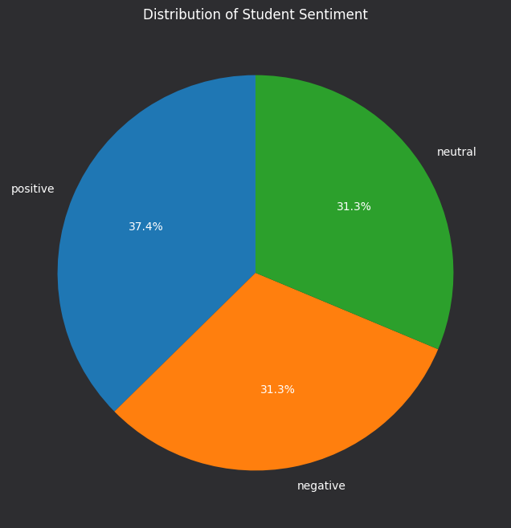

# Fine-Tuning BERT for Sentiment Analysis


   

## Problem Statement

The task involves fine-tuning a pre-trained language model, such as BERT, to perform sentiment analysis on a custom dataset. The dataset contains student reviews about campus events or amenities, labeled by sentiment (e.g., positive, negative, neutral). The objective is to train the model to effectively classify the sentiments while maintaining high performance metrics like accuracy.

## Approach

1. **Data Preparation:**
   - Synthetically generated data using ```Groq/llama-3.3-70b-versatile```
   - Preprocessed the data to clean and tokenize the review texts.
   - Split the dataset into training, validation, and test sets.

2. **Model Fine-Tuning:**
   - Used Hugging Face's Transformers library to fine-tune the BERT model.
   - Customized the model's architecture by adding a classification head.


3. **Evaluation:**
   - Measured accuracy and confusion matrix metrics.
   - Visualized sentiment distributions using graphs and charts.

4. **Deployment (Bonus):**
   - Built a REST API using FastAPI to enable users to submit reviews and receive sentiment predictions.

## Results

### Performance Metrics

| Metric         | Value  |
|----------------|--------|
| Train loss       | 0.7093283434708914  |
|Eval loss| 0.4079654812812805|

### Confusion Matrix


### Sentiment Distribution



## Challenges

1. **Data Collection Issues:**
    - Challenge: It was difficult to obtain a comprehensive dataset of student reviews about campus events or amenities.
    - Solution: Overcame this by synthetically generating data using ```Groq/llama-3.3-70b-versatile```.

2. **Model Overfitting:**
   - Solution: Used dropout layers and reduced the learning rate.

3. **API Deployment:**
   - Solution: Researched FastAPI and integrated it effectively with the trained model.

## Installation

1. Clone the repository:
   ```bash
   git clone https://github.com/messi10tom/Fine-Tuning-BERT-for-Sentiment-Analysis
   ```
2. Navigate to the project directory:
   ```bash
   cd Fine-Tuning-BERT-for-Sentiment-Analysis
   ```

3. Install dependencies:
   ```bash
   pip install -r requirements.txt
   ```

4. Run the API or web app:
   ```bash
   python app.py
   ```

## Model Description

The model is based on BERT (Bidirectional Encoder Representations from Transformers). Below is a high-level architecture:


1. Input Layer: Accepts tokenized review text.
2. Pre-trained BERT Layers: Encodes contextual information from the text.
3. Classification Head: Adds fully connected layers to classify sentiments.

## Screenshots

### Training - Validation Logs


## Additional Features

1. REST API:
   - Submit a review to receive sentiment predictions.
   - Endpoint: `/predict`


## License

This project is licensed under the MIT License. See the LICENSE file for details.
